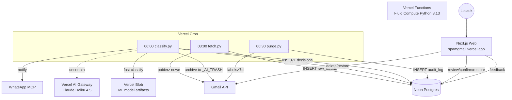
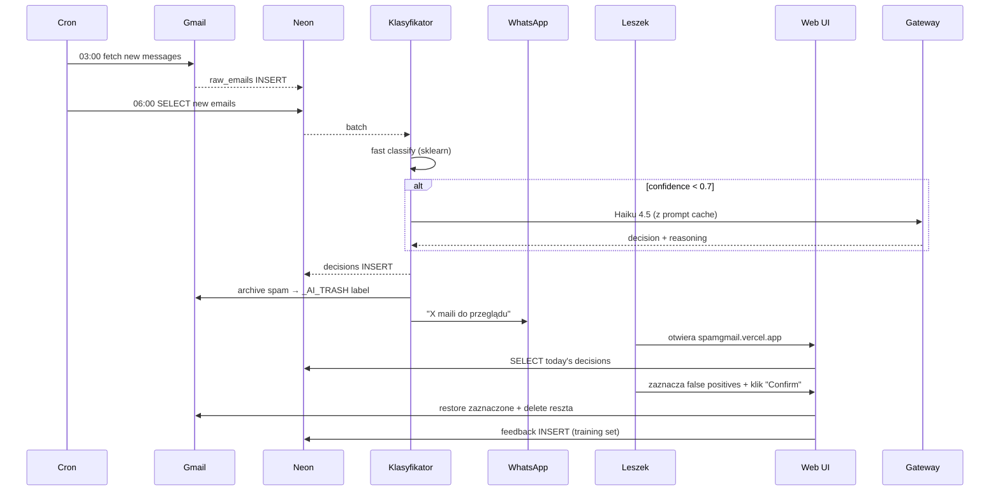
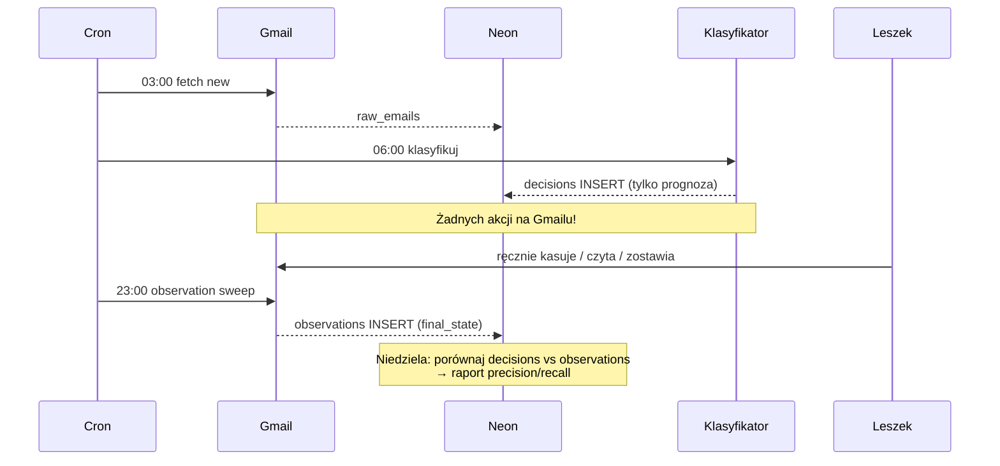

# HLD — SPAM Gmail

## Architektura

## Flow: dzień typowy (Faza 2 — ASSISTED_MODE)

## Flow: Faza 1 — SHADOW_MODE (tydzień 1)

## Komponenty

| Komponent | Technologia | Odpowiedzialność |
|-----------|-------------|------------------|
| **Cron fetch** | Python Vercel Function | Pobranie nowych maili z Gmail → Neon |
| **Cron classify** | Python Vercel Function | Klasyfikacja + (opc.) archiwizacja |
| **Cron purge** | Python Vercel Function | Trwałe kasowanie po 7 dniach |
| **Cron observe** | Python Vercel Function | (Shadow mode) zapisanie final_state |
| **Web UI** | Next.js App Router | Poranny przegląd + potwierdzenia |
| **Classifier** | scikit-learn | Szybka klasyfikacja na cechach |
| **LLM adapter** | Anthropic SDK + AI Gateway | Haiku 4.5 dla niepewnych |
| **Gmail wrapper** | google-api-python-client | fetch, archive, label, delete |
| **DB** | Neon Postgres | raw_emails, decisions, observations, feedback, audit_log |

## Feature flagi (Vercel Edge Config)

| Flag | Default | Opis |
|------|---------|------|
| `SHADOW_MODE` | `true` | Model tylko obserwuje, żadnych akcji |
| `AUTO_DELETE` | `false` | Auto-kasowanie bez potwierdzenia |
| `LLM_ENABLED` | `true` | Użyj Haiku dla niepewnych |
| `EMERGENCY_STOP` | `false` | Kill switch — cron exit early |
| `DRY_RUN` | `false` | Loguj decyzje ale nie wykonuj akcji |

## Model versioning

Każda decyzja zapisuje `model_version` (np. `v2025-04-14_gbm_v1`). Modele ML w Vercel Blob: `models/{version}.joblib`. Retrening tworzy nową wersję, eval harness porównuje; promocja dopiero po ≥ baseline.
